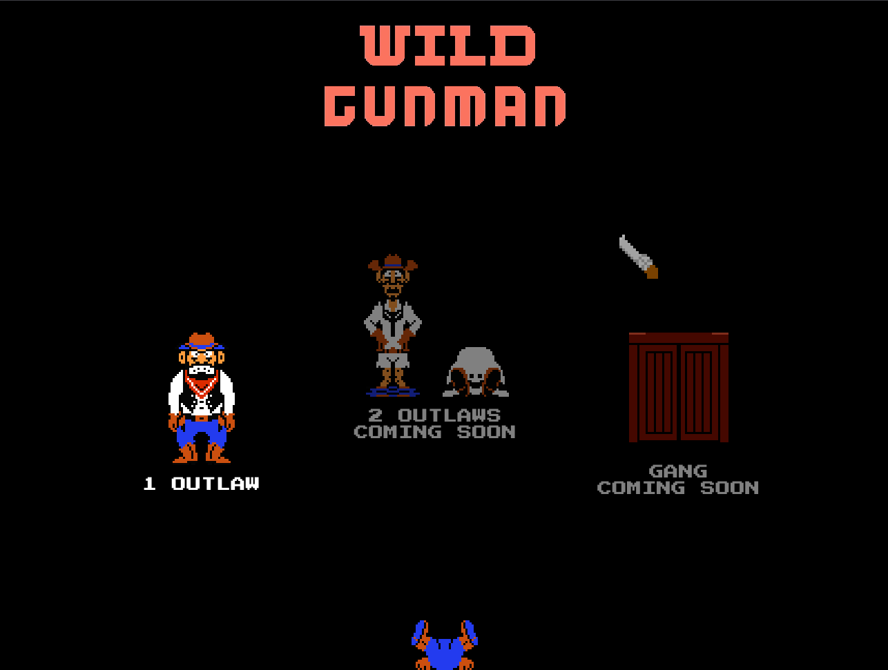
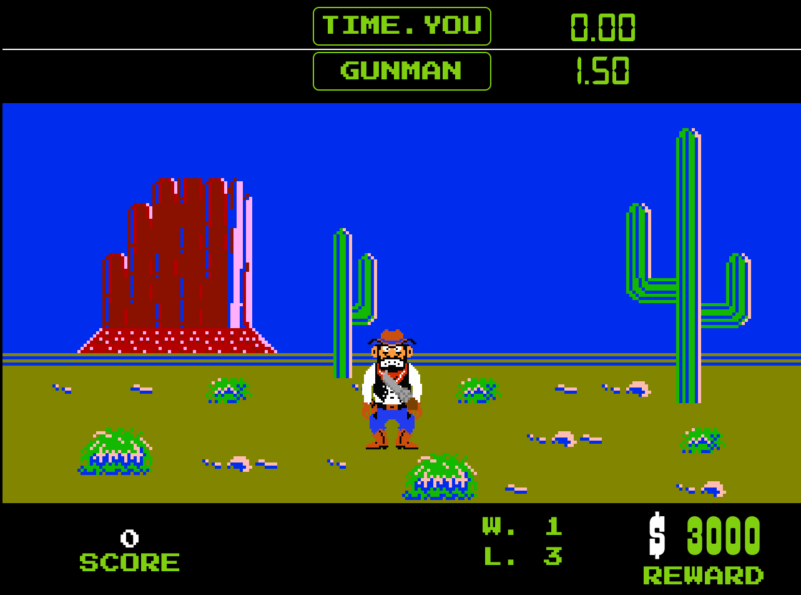

# Wild Gunman, but it's made in HTML/CSS/JS.

This is a faithful non-commercial web recreation of a classic NES Zapper game, "Wild Gunman". Test your reaction in exciting and tempting duels, and see if you can withstand dangerous outlaws of the Wild West.

Made with vanilla HTML, CSS and JavaScript.

## To-do:
- Score saves with localStorage.
~~- Infinite mode (do not end on the 5th level).~~
- Add other modes (with two outlaws and gang).
- Add screen adaptivity.

## Copyright
    
All rights reserved for original code and assets. *Wild Gunman* and related properties are trademarks and copyrights of Nintendo Co., Ltd. Game sprites and resources were taken from public sources (such as [spriters-resource](https://www.spriters-resource.com/nes/wild-gunman)). The project is non-commercial and made for educational and personal use.